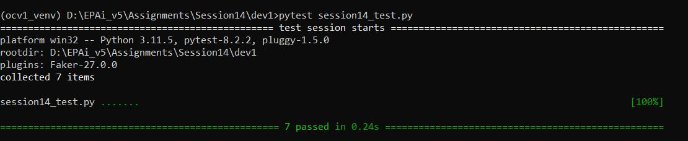
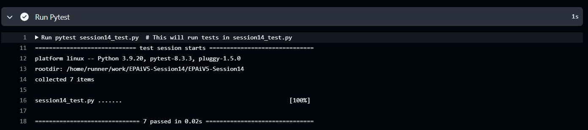

# Python Text Processing Utilities
## Overview
This repository contains module `text_toolkit.py` which has a set of Python functions designed to perform various text processing tasks, including word frequency analysis, unique word extraction, co-occurrence matrix generation, and a text generator. The script can process both plain text strings and text files. Each function is equipped with robust error handling and optional filtering mechanisms to customize the output.

The module `text_toolkit.py` supports large text files by using generators to handle memory efficiently. It allows for reuse and easy integration into larger AI projects (e.g., for NLP tasks). The functions are designed in such a way that they should accept both file paths and string inputs. These utilities are particularly useful for tasks such as analyzing word patterns, preparing data for natural language processing (NLP) models, and identifying co-occurrence relationships in text corpora. To ensure proper file handling, context managers are used. 
This module uses scopes, closures, and functional parameters where applicable.

## Function Descriptions
#### `1. word_frequency(text_or_file, filter_func=None)`
This function calculates the frequency of each word in the given input, which can either be a text string or a file path to a text file. Words are normalized to lowercase, and special characters are removed.

We can optionally pass a filter function to only count specific words that meet certain criteria. For instance, we may want to exclude very short words or limit the count to words of a particular length.

##### Parameters:
- `text_or_file (str)`: A string of text or a file path to a text file.
- `filter_func (callable, optional)`: A filtering function that is applied to each word before counting. If omitted, all words will be counted.

##### Returns:
A dictionary where the keys are words and the values are their frequency counts.

##### Example Usage:

```
# Example: Count the frequency of words longer than 2 characters
result = word_frequency("This is a test text. This test is only a test.", lambda word: len(word) > 2)
print(result)

```
#### `2. unique_words(text_or_file)`
This function extracts the unique words from a text string or file. All special characters are stripped, and the text is converted to lowercase to avoid case sensitivity. The result is a set of unique words, which can be helpful when performing text analysis or preparing data for machine learning models.

##### Parameters:
- `text_or_file (str)`: A text string or a file path.

##### Returns:
A set of unique words from the input text.

##### Example Usage:

```
# Extract unique words from a text
unique_words_set = unique_words("This is a test text. This test is only a test.")
print(unique_words_set)

```

#### `3. word_co_occurrence_matrix(text_or_file, window=2)`
This function generates a word co-occurrence matrix, which identifies pairs of adjacent words in the text. It can handle text strings as well as text files. You can specify the size of the "window" for fetching adjacent words. This is particularly useful for analyzing the relationships between words and their context within a corpus.

##### Parameters:
- `text_or_file (str)`: A string of text or a file path to a text file.
- `window (int)`: Defines how many adjacent words should be paired together (default is 2).

##### Returns:
A list of tuples representing the co-occurrence matrix, where each tuple contains words that appear next to each other within the given window size.

##### Example Usage:

```
# Generate a co-occurrence matrix for the text
co_occurrence_pairs = word_co_occurrence_matrix("this is a simple test text", window=2)
print(co_occurrence_pairs)

```

#### `4. text_generator(text_or_file)`
This function yields lines of text one by one, either from a plain text string or from a file. It is useful when you need to process large text files without loading the entire file into memory, thus allowing for memory-efficient text processing. The function also cleans the text by removing special characters and converting it to lowercase before yielding each line.

##### Parameters:
- `text_or_file (str)`: A text string or a file path.

##### Yields:
- Each line of text, cleaned and processed.

##### Example Usage:

```
# Use the generator to process text line by line
for line in text_generator("This is the first line.\nThis is the second line."):
    print(line)

```
## Error Handling
Each function includes basic error checking:

- TypeError: Raised if the input is not a valid string or file path.
- IOError: Raised if the provided file path is invalid or the file cannot be read.

## Use Cases
1. Word Frequency Analysis: Determine the most common words in a document, applying optional filters based on custom criteria.
2. Unique Word Extraction: Extract a set of unique words from a large text corpus for vocabulary analysis.
3. Word Co-Occurrence: Analyze relationships between words, useful in NLP tasks such as building a word2vec model or examining term dependencies.
4. Text Streaming: Stream large text files or multi-line strings efficiently using the `text_generator`.

## Test Results

### Results - Local PC Testing



### Results - Git Actions



## License
This code is open-source and available for public use. Anyone is free to modify and distribute the code as needed for the projects.

## Conclusion
This Python script offers a flexible solution for text processing and analysis, whether you're working with small text snippets or large files. It provides a simple interface for extracting word frequencies, unique words, co-occurrences, and more, making it useful for a variety of natural language processing tasks.


---------------------------------------------------------------------------------------------------------------------------------------------------

**Submission by** - Hema Aparna M

**mail id** - mhema.aprai@gmail.com

---------------------------------------------------------------------------------------------------------------------------------------------------
